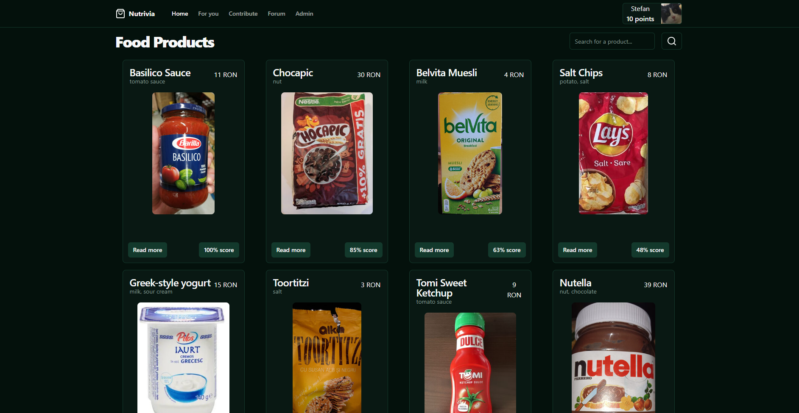

# Nutrivia

Nutrivia is a web app designed to help its user make better decision regarding the food products they buy. For more informations, read the [docs](./docs/introduction.md).

## Documentation (work in progress)

Markdown docs are available in the `./docs` directory. Start with the [introduction](./docs/introduction.md).

To run the app locally, you need to install the dependencies (`pnpm i`) and fill in the environment variables (look at `.env.example`).
