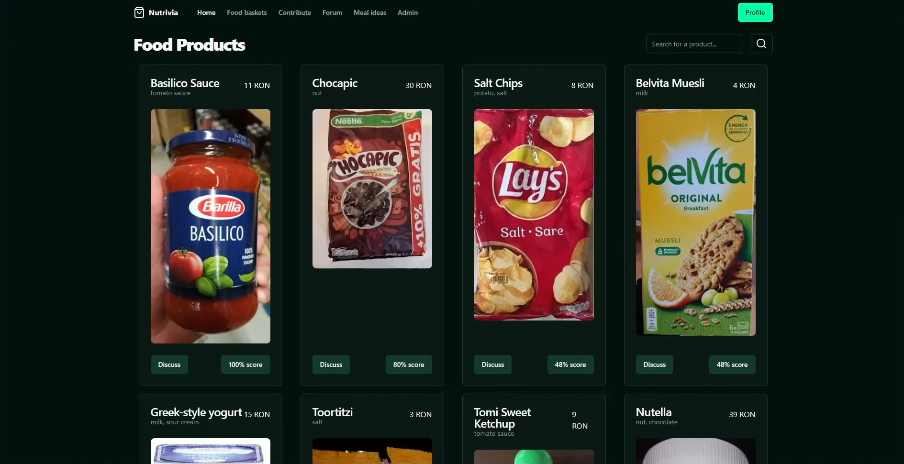

# Nutrivia

Nutrivia is a web app designed to help its user make better decision regarding the food products they buy. For more informations, read the [docs](./docs/introduction.md).

## FIICode

This project was created for the FIICode Web&Mobile 2024 contest. Team name: Glitchd. Team members:

- Asandei Stefan-Alexandru

Video for the Hackathon: https://youtu.be/Jk3sTCoEh8I

Video presentation (whole project): https://youtu.be/3l_ZUBY1Qeo

## Documentation

Markdown docs are available in the `./docs` directory. Start with the [introduction](./docs/introduction.md).

To run the app locally, you need to install the dependencies (`pnpm i`) and fill in the environment variables (look at `.env.example`).
